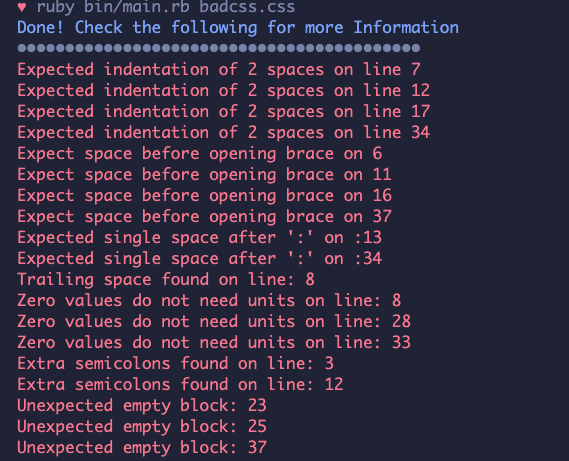

<h1 align="center">CSS Linter</h1>

---

## 📝 Content
<p align="center">
<a href="#about">About</a>&nbsp;&nbsp;&nbsp;|&nbsp;&nbsp;&nbsp;
<a href="#builtwith">Built with</a>&nbsp;&nbsp;&nbsp;|&nbsp;&nbsp;&nbsp;
<a href="#installing">Installing</a>&nbsp;&nbsp;&nbsp;|&nbsp;&nbsp;&nbsp;
<a href="#testing">Testing</a>&nbsp;&nbsp;&nbsp;|&nbsp;&nbsp;&nbsp;
<a href="#styleguide">Style Guide</a>&nbsp;&nbsp;&nbsp;|&nbsp;&nbsp;&nbsp;
<a href="#author">Author</a>
</p>


## ✒️ About <a name = "about"></a>
<p align="center">
This is a css linter that helps you avoid errors and enforce conventions in your styles.</p>


---

## 🔧 Built with<a name = "builtwith"></a>

- [Ruby](https://rubyonrails.org/)
- RSpec for Ruby Testing
- Colorize gem


## 🛠 Installing <a name = "installing"></a>

### Pre-requisites

- Ruby installed on local machine. Check [this](https://www.ruby-lang.org/en/documentation/installation/) for Installation Guide


- Rubocop Linter installed on Machine

      Install Using this command:
    ```
    gem install rubocop

    ```

- Rspec for testing  installed on Machine

  Install Using this command:
```
gem install rspec

```

- Colorize Gem installed on Machine

 Install Using this command:
```
gem install colorize

```


## Usage

Clone this repository 
```
git clone git@github.com:Maryjanee/CSS-Linter.git
```
```
cd CSS-Linter
```

Type in the following command to run the linter on a css file in the folder
```
ruby bin/main.rb badcss.css

```


## Testing Instructions <a name = "testing"></a>

- Clone the repository
- Change directory to the cloned directory `cd CSS-Linter `
- Switch to test branch `git checkout linter`
- Run `bundle install` to install the dependencies specified in the Gemfile
- Run `rspec` to test


## Style Guide <a name = "styleguide"></a>


<p> This Linter Enforces rules for the following </p>

### 1. Block Indentation
    Checks for 2 space indentation of rules in a block

      ```
      # Bad Code
      p {
      padding: 1rem;
      border-radius: 50%  
      }


      # Good Code
      p {
        padding: 1rem;
        border-radius: 50%  
      }
      ```

### 2. No Empty Block Rule
      Check for empty block rule and flags appropriately

        ```
        # Bad Code
        div{}


        # Good Code
        div {
          background: green;
          border-radius: 50%  
        }
        ```

### 3. Length Zero Should Take No Unit
       Checks that length of zero takes no unit

        ```
        # Bad Code
        p {
            padding: 0% ;
        }


        # Good Code
        p {
          padding:0; 
        }
        ```

### 4. Space before block opening brace 
        Checks that a space is added before the opening brace of a block

        ```
        # Bad Code
        a{
            display: block
            border: 2px solid green;
        }


        # Good Code
        a {
            display: block
            border: 2px solid green;
        }
        ```
      
### 5. No Extra semi-colons added
        Checks that the end of a rule only contains one semi colon

        ```
        # Bad Code
        button{
            padding: 1rem 1.5rem;;
        }


        # Good Code
        button{
            padding: 1rem 1.5rem;
        }

        ```
      
### 6. Declaration Colon space After
       Checks that declaration takes a space after before the value

        ```
        # Bad Code
        footer {
          background:#eee;
        }


        # Good Code
        footer {
          background: #eee;
        }
        ```
      
### 7. No trailing spaces
       Checks that there are no trailing spaces after a rule

        ```
        # Bad Code
        p {
            color: grey ; | 
        }


        # Good Code
        p {
            color: grey ;
        }
        ```

## ✒️ Author <a name = "author"></a>

👤 **Maryjane Akpagbue**

- Github: [Maryjanee](https://github.com/Maryjanee)
- Twitter: [Maryjane Akpagbue](https://twitter.com/alfredmaryjane)
- Linkedin: [Maryjane Akpagbue](https://www.linkedin.com/in/maryjane-akpagbue-1500b7173/)


## Contributing

- To contribute to this project:
- Fork this repository & clone locally.
- Create an upstream remote and sync your local copy.
- create a new branch.
- Push your code to your origin repository.
- Create a new Pull Request .
- Feel free to check the [issues page](https://github.com/Maryjanee/CSS-Linter/issuess).

## 👍 Show your support

Give a ⭐️ if you like this project!

## :clap: Acknowledgements

- Microverse
